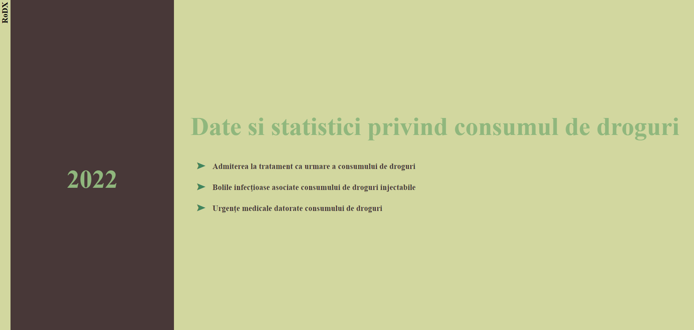
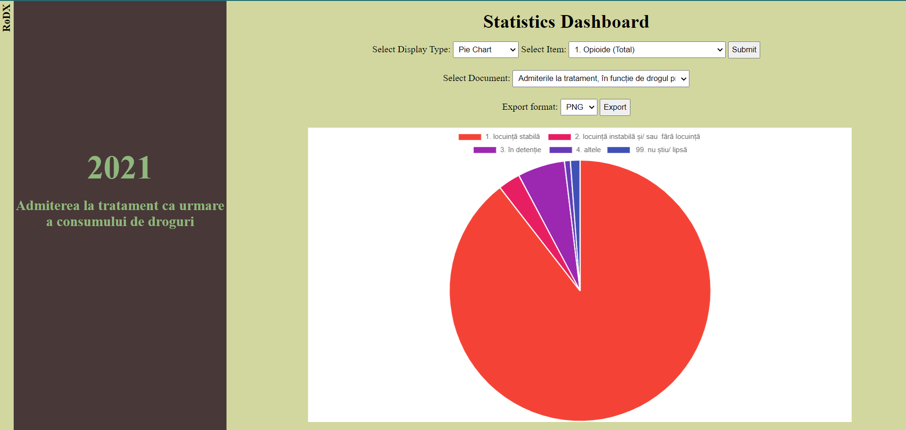
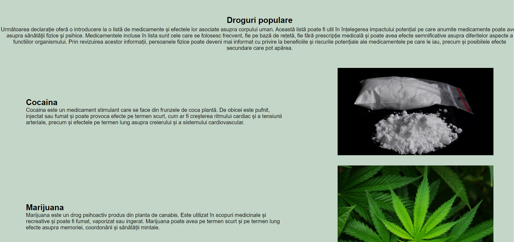

# Romanian Drug Explorer (RoDX)

## Overview  
Romanian Drug Explorer (RoDX) is a web-based platform that utilizes statistical data on [drug-related situations in Romania](https://data.gov.ro/organization/agentia-nationala-antidrog) to provide an analysis and visualization tool. The system examines drug consumption trends over the past **A years** (minimum 3) in correlation with crime rates, drug seizures, medical emergencies, and prevention campaigns.  

Users can perform multi-criteria searches and generate reports in **HTML** and **CSV** formats. The platform also features a dedicated **REST/GraphQL API** for data access. Additionally, it offers at least **three visualization methods**, which can be exported in **PNG** and **SVG** formats.  

## Features  
- User authentication (Signup/Login)  
- Interactive data exploration with various filters  
- Visualization in multiple formats (Pie Chart, Bubble Chart, Bar Chart, CSV Table)  
- Data export in PNG and SVG formats  
- REST/GraphQL API for data access  
- Admin functionalities (user management)  

## Tech Stack  
- **Frontend:** HTML, CSS, JavaScript  
- **Backend:** Node.js, JSON, MongoDB  

## Usage  
1. Register or log in to access the platform.  
2. Select the desired year and report type.  
3. View interactive visualizations based on selected filters.  
4. Export data or download reports as needed.  

## Pages
### Sign In

### Sign Up

### Home

### Documents available depending on the selected year

### Statistics according to search criteria (year, document, information)

### Profie

### Popular Drugs

## Documentation
https://rodx.onrender.com/documentation

## Presentation
https://youtu.be/Q4afix9HTHs

## Contributors
- Robert-Alexandru Zaharia
- Ana-Maria Constantin
- Ana-Delia Manoliu
